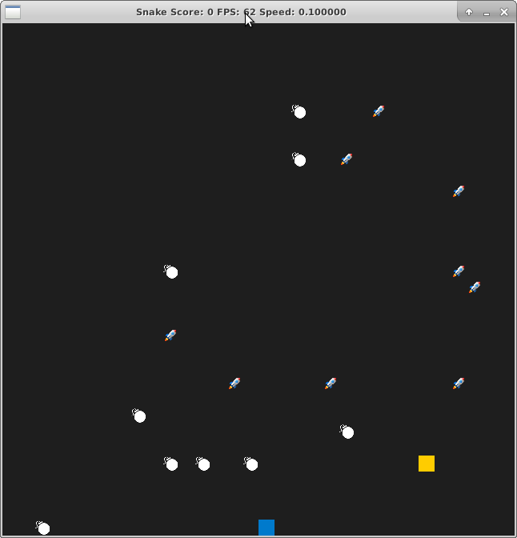

# CPPND: Capstone Snake Game

This is the final Capstone project of the [Udacity C++ Nanodegree Program](https://www.udacity.com/course/c-plus-plus-nanodegree--nd213). The code for this repo was inspired by [this](https://codereview.stackexchange.com/questions/212296/snake-game-in-c-with-sdl) excellent StackOverflow post and set of responses.

 

## Game Features
1. There are boosters marked by 🚀 which will speed up the snake's speed.
2. New boosters will be randomly placed in the game after you eat any of them.
3. Beware of obstacles.
4. Parameters such as number of obstacles and boosters can be configured from [gameConfig/config.txt](./gameConfig/config.txt) file.
5. A starting screen has been added.
6. The game can be reset in the starting screen.

## Dependencies for Running Locally
* cmake >= 3.7
  * All OSes: [click here for installation instructions](https://cmake.org/install/)
* make >= 4.1 (Linux, Mac), 3.81 (Windows)
  * Linux: make is installed by default on most Linux distros
  * Mac: [install Xcode command line tools to get make](https://developer.apple.com/xcode/features/)
  * Windows: [Click here for installation instructions](http://gnuwin32.sourceforge.net/packages/make.htm)
* SDL2 >= 2.0
  * All installation instructions can be found [here](https://wiki.libsdl.org/Installation)
  * Note that for Linux, an `apt` or `apt-get` installation is preferred to building from source.
* SDL2 TTF >= 2.0
  * All installation instructions can be found [here](https://www.libsdl.org/projects/SDL_ttf/docs/SDL_ttf.html)
  * Note that for Linux, an `apt` or `apt-get` installation is preferred to building from source.
    * sudo apt install libsdl2-ttf-dev
    * sudo apt-get install libsdl2-ttf-dev
* gcc/g++ >= 5.4
  * Linux: gcc / g++ is installed by default on most Linux distros
  * Mac: same deal as make - [install Xcode command line tools](https://developer.apple.com/xcode/features/)
  * Windows: recommend using [MinGW](http://www.mingw.org/)

## Basic Build Instructions

1. Clone this repo.
2. Make a build directory in the top level directory: `mkdir build && cd build`
3. Compile: `cmake .. && make`
4. Run it: `./SnakeGame`.

## Meets Rubric
1. The project demonstrates an understanding of C++ functions and control structures.
2. The project reads data from a file and process the data, or the program writes data to a file.
3. The project uses Object Oriented Programming techniques.
4. Classes use appropriate access specifiers for class members.
5. Class constructors utilize member initialization lists.
6. Classes abstract implementation details from their interfaces.
7. Classes encapsulate behavior.
8. The project makes use of references in function declarations.
9. The project uses move semantics to move data, instead of copying it, where possible.
10. The project uses smart pointers instead of raw pointers.
